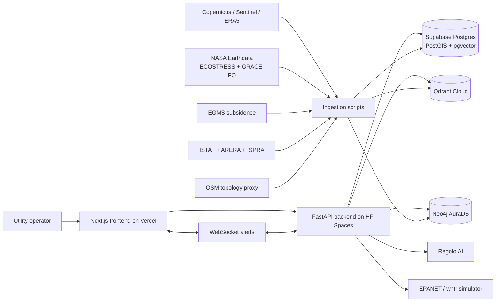

<p align="center">
  
</p>

<h1 align="center">Droplet</h1>

<p align="center">
  Water-network intelligence for utilities: satellite signals, hydraulic simulation, AI explanations, and auditable human-in-the-loop decisions.
</p>

<p align="center">
  <strong>CASSINI Hackathon #11 - EU Space for Water</strong><br />
  Pilot territory: <strong>Ciociaria, Frosinone, Lazio</strong>, where Non-Revenue Water reaches <strong>69.5%</strong> in ISTAT 2020 data.
</p>

---

## Table of Contents

- [Overview](#overview)
- [Core Capabilities](#core-capabilities)
- [Full Tech Stack](#full-tech-stack)
- [Architecture](#architecture)
- [Repository Structure](#repository-structure)
- [Data Sources](#data-sources)
- [Application Modules](#application-modules)
- [API Surface](#api-surface)
- [Local Development](#local-development)
- [Environment Variables](#environment-variables)
- [Deployment Model](#deployment-model)
- [Compliance and Auditability](#compliance-and-auditability)
- [Current Scope](#current-scope)
- [License](#license)

## Overview

Droplet is a water-network intelligence platform for Italian mid-size utilities. It combines Earth observation, hydraulic modelling, graph retrieval, vector search, and an AI operations agent to prioritize leaks, explain anomalies, and support traceable operational decisions.

The project is built around a concrete pilot: Ciociaria, in the province of Frosinone. The pilot was selected because it has one of the most severe water-loss profiles in Italy, making it a useful stress case for satellite-assisted monitoring and decision support.

Droplet does not replace SCADA, GIS, or utility operators. It sits above existing systems as an intelligence and audit layer.

## Core Capabilities

- Pipe Health Index: multi-signal risk score for each pipe segment.
- Satellite anomaly fusion: Sentinel, ERA5, ECOSTRESS, EGMS, GRACE-FO, and JRC GSW signals.
- Hydraulic digital twin: EPANET-based simulation through `wntr`.
- Tank telecontrol: synthetic telemetry, anomaly levels, and alert stream.
- IWA water balance: DMA-level loss accounting and KPI support.
- TDOA burst localization: simulated Galileo HAS timing for leak triangulation.
- GraphRAG agent: Neo4j graph walk plus Qdrant retrieval for explainable recommendations.
- Human-in-the-loop control: recommendations require operator approval or rejection.
- Audit trail: prompt, sources, tool calls, confidence, and operator action are preserved.

## Full Tech Stack

### Frontend

| Area | Technology |
| --- | --- |
| Framework | Next.js 15.5 App Router |
| Runtime | React 19.2 |
| Language | TypeScript |
| Styling | Tailwind CSS v4, custom CSS variables, glass/liquid UI system |
| State | Zustand |
| Data fetching | TanStack Query, server/client route composition |
| Maps | deck.gl, react-map-gl, MapLibre GL |
| Charts | Recharts |
| 3D/visuals | Three.js, React Three Fiber, Drei |
| UI helpers | Radix Slot, Radix Tooltip, lucide-react, clsx, tailwind-merge |
| Markdown | react-markdown, remark-gfm |
| Hosting target | Vercel |

### Backend

| Area | Technology |
| --- | --- |
| Framework | FastAPI 0.115 |
| Runtime | Python 3.11 |
| ASGI server | Uvicorn |
| Validation | Pydantic 2, pydantic-settings |
| HTTP client | httpx |
| Relational DB client | psycopg 3 |
| Vector DB client | qdrant-client |
| Graph DB client | neo4j |
| Hydraulic engine | EPANET through `wntr` |
| ML utilities | scikit-learn |
| Config | python-dotenv and environment variables |
| Hosting target | Hugging Face Spaces Docker runtime |

### Data and Intelligence

| Layer | Technology / Service | Purpose |
| --- | --- | --- |
| Relational store | Supabase Postgres with PostGIS and pgvector | Operational entities, audit records, geospatial data |
| Vector store | Qdrant Cloud | Hybrid retrieval over regulations, incidents, and AI decisions |
| Graph store | Neo4j AuraDB | Network topology, dependency paths, GraphRAG traversal |
| AI provider | Regolo AI | EU-sovereign orchestration, embeddings, reranking, and generation |
| Hydraulics | EPANET 2.2 model via `wntr` | Flow, pressure, tank behaviour, and incident simulation |
| Earth observation | Copernicus, NASA Earthdata, EGMS, JRC GSW | Environmental and ground-motion signals |
| Timing signal | Galileo HAS, simulated in the demo | High-accuracy burst localization timing |

### AI Models

| Model | Role |
| --- | --- |
| `gpt-oss-120b` | Main AI orchestrator |
| `Qwen3.6-27B` | Vision and report generation |
| `Qwen3-Embedding-8B` | Dense embeddings |
| `Qwen3-Reranker-4B` | Retrieval reranking |

## Architecture



## Repository Structure

```text
.
├── backend/                 # FastAPI application, routers, services, DB adapters
│   ├── app.py               # FastAPI entrypoint and router registration
│   ├── routers/             # API endpoints grouped by domain
│   ├── services/            # Business logic, AI tools, simulation, retrieval
│   ├── db/                  # Supabase, Qdrant, Neo4j adapters and schema
│   └── requirements.txt     # Python dependencies
├── frontend/                # Next.js App Router frontend
│   ├── app/                 # Routes and route-level UI
│   ├── components/          # Reusable UI, map, chat, shell, and domain components
│   ├── lib/                 # API, SSE, WebSocket, incident, and utility clients
│   ├── store/               # Zustand state stores
│   └── public/              # Droplet logo and static assets
├── ingestion/               # Scripts for topology, regulatory docs, and signal ingestion
├── data/processed/          # Processed pilot data and audit/data-study artifacts
├── ops/                     # Operational helper scripts
├── cache/                   # Cached source payloads
├── plan.md                  # Implementation and deployment plan
└── sources.md               # Source inventory and references
```

## Data Sources

| Source | Use |
| --- | --- |
| ERA5 | Weather confounders and scarcity signal |
| Sentinel-2 | NDVI/NDWI vegetation and corridor anomalies |
| Sentinel-3 | Land surface temperature signal |
| ECOSTRESS | High-resolution thermal anomaly signal |
| EGMS | Differential subsidence per network segment |
| GRACE-FO | Regional aquifer mass anomaly |
| JRC Global Surface Water | Surface water seasonality |
| Galileo HAS | Simulated sub-microsecond timing for burst localization |
| ISPRA | Historical water intake and environmental context |
| ISTAT | NRW baseline and municipal water statistics |
| ARERA | Regulatory corpus and KPI calibration |
| OpenStreetMap | Topology proxy for synthetic network generation |
| EPANET | Hydraulic network simulation |

## Application Modules

### Landing Page

The public landing page presents Droplet, the platform value proposition, data sources, and the team. It lives in `frontend/app/page.tsx`.

### Operations Dashboard

The authenticated app shell exposes operational views for the pilot network, including DMAs, tanks, map overlays, incidents, Copernicus status, investment analysis, and AI chat.

### Source Intelligence

Source views combine karst spring, well, surface-water, ERA5, GRACE-FO, and scarcity-forecast signals to reason about upstream availability.

### Distribution Intelligence

Distribution views expose pipe health, map overlays, graph topology, GIS layers, DMA balances, and segment-level explanations.

### Tank Telecontrol

Tank pages expose synthetic level, flow, pump, and anomaly state. Alerts can be streamed over WebSocket for live demo behaviour.

### AI Agent

The AI agent uses retrieval and graph traversal tools to explain anomalies, cite sources, propose control recommendations, and keep a decision record for operator review.

## API Surface

The backend is organized by FastAPI routers:

| Domain | Routes |
| --- | --- |
| Health | `GET /healthz` |
| Segments | `GET /api/segments`, `GET /api/segments/{segment_id}` |
| Tanks | `GET /api/tanks`, `GET /api/tanks/{tank_id}` |
| DMAs | `GET /api/dmas`, `GET /api/dmas/{dma_id}/balance` |
| Incidents | `GET /api/incidents`, `PATCH /api/incidents/{incident_id}` |
| Network | `GET /api/network/graph`, `GET /api/network/areas` |
| GIS | `GET /api/gis/overlay` |
| Source | `GET /api/source/availability`, `GET /api/source/scarcity-forecast` |
| Explain | `GET /api/explain/{entity_type}/{entity_id}` and typed helpers |
| Audit | `GET /api/audit` |
| Chat | `POST /api/chat` |
| Alerts | `WS /ws/alerts` |
| Control | `GET /api/control-recommendations`, approve/reject endpoints |
| Investments | ARERA indicators, calculator, strategy, Supabase status |
| Daily digest | `GET /api/daily-digest/today` |
| Ceccano pilot | Overview, districts, valves, GIS, forecast, reservoirs, alerts |
| Copernicus | Status, Sentinel-2, Sentinel-3, ERA5, ECOSTRESS, GSW, ingest |

## Local Development

### Prerequisites

- Node.js compatible with Next.js 15
- npm
- Python 3.11
- Access keys for remote services when running connected mode

### Frontend

```bash
cd frontend
npm install
cp .env.example .env.local
npm run dev
```

Default local URL:

```text
http://localhost:3000
```

### Backend

```bash
cd backend
python -m venv .venv
.\.venv\Scripts\Activate.ps1
pip install -r requirements.txt
cp .env.example .env
uvicorn app:app --reload --port 7860
```

Default local URL:

```text
http://localhost:7860
```

### Useful Checks

```bash
cd frontend
npm run build
```

```bash
cd backend
python -m compileall .
```

Note: the current frontend `lint` script expects an ESLint v9 flat config. If `eslint.config.*` is not present, `npm run lint` will fail before linting source files.

## Environment Variables

### Frontend

| Variable | Purpose |
| --- | --- |
| `NEXT_PUBLIC_API_BASE` | HTTP base URL for the FastAPI backend |
| `NEXT_PUBLIC_WS_BASE` | WebSocket base URL for alerts |
| `NEXT_PUBLIC_SUPABASE_URL` | Supabase project URL |
| `NEXT_PUBLIC_SUPABASE_PUBLISHABLE_KEY` | Browser-safe Supabase key |
| `NEXT_PUBLIC_MOCK_AUTH` | Enables local mock login flow |
| `NEXT_PUBLIC_MOCK_USERNAME` | Mock username |
| `NEXT_PUBLIC_MOCK_PASSWORD` | Mock password |

### Backend

| Group | Variables |
| --- | --- |
| Regolo AI | `REGOLO_API_BASE`, `REGOLO_API_KEY`, model variables |
| Supabase | `SUPABASE_URL`, `SUPABASE_SECRET_KEY`, `SUPABASE_PUBLISHABLE_KEY`, `SUPABASE_DB_URL` |
| Qdrant | `QDRANT_URL`, `QDRANT_API_KEY`, collection names |
| Neo4j | `NEO4J_URI`, `NEO4J_USER`, `NEO4J_PASSWORD` |
| Copernicus | `CDS_API_URL`, `CDS_API_KEY`, `OPENEO_URL`, CDSE credentials |
| NASA Earthdata | `EARTHDATA_USER`, `EARTHDATA_PASSWORD` |
| EGMS | `EGMS_USER`, `EGMS_PASSWORD` |
| Runtime | `ALLOWED_ORIGINS`, `DROPLET_ENABLE_SIM` |
| Pilot | `PILOT_BBOX_*`, `PILOT_PLACE`, source collection names |

## Deployment Model

| Component | Target |
| --- | --- |
| Frontend | Vercel |
| Backend | Hugging Face Spaces with Docker SDK |
| Relational database | Supabase, EU region |
| Vector database | Qdrant Cloud |
| Graph database | Neo4j AuraDB |
| AI inference | Regolo AI |

Production secrets are injected through the hosting platform secret managers. Local `.env` files are ignored by Git and should not be committed.

### Backend Deployment to Hugging Face Spaces

The backend is committed in this repository as a normal directory so the source code is visible on GitHub. Hugging Face Spaces remains a separate Git deployment target.

To publish backend changes to the Space, push only the `backend/` subtree to the Space repository:

```bash
git subtree push --prefix backend https://huggingface.co/spaces/Alessandro0709/Droplet main
```

Do not store Hugging Face tokens in Git remotes. Use your Git credential manager, `huggingface-cli login`, or a temporary authenticated URL only for the command that needs it.

## Compliance and Auditability

Droplet is designed around EU-regulated operational decision support:

- EU-sovereign AI inference through Regolo AI.
- GDPR-conscious architecture with environment-scoped secrets.
- Human-in-the-loop approval for control recommendations.
- Explainability surfaces for segments, tanks, and incidents.
- Audit logs for AI prompts, retrieved evidence, graph paths, confidence, and operator action.
- Source-backed retrieval over regulatory and operational material.

## Current Scope

Droplet is a hackathon-grade pilot and demonstration platform.

It is not:

- A SCADA replacement.
- A guarantee of burst prediction.
- A live production utility deployment.
- A substitute for engineering review.
- A financial planning system.

The pilot network is synthetic where direct utility data is unavailable, but it is calibrated around real territorial, regulatory, and environmental priors.

## License

MIT
